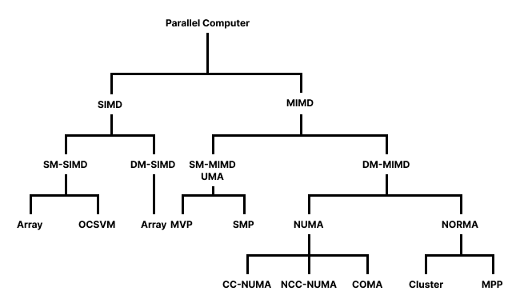
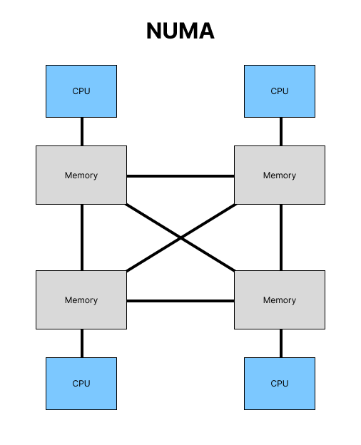
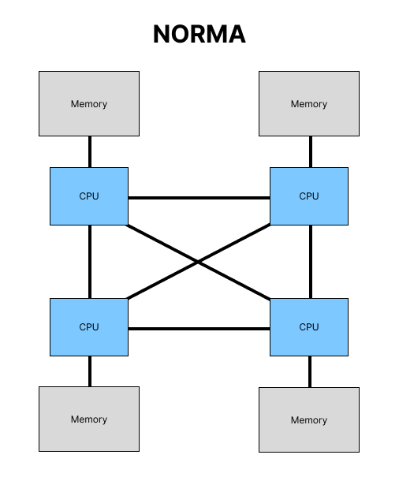

import Callout from '../../../../components/Callout.astro';

A supercomputer is a high-performance computer system, designed to process large and complex calculations. Usually they are used for science, engineering, AI and national security, where traditional computers fall short in processing power. Common applications include simulating weather patterns, modelling climate change, analysing fluid dynamics, decrypting sensitive information and training large language models.

What sets them apart from regular computers is their massive computational scale, parallel architectures and their role in solving problems that demand immense processing capabilities.

## Key Characteristics

### High Performance

To gauge how good a supercomputer is, we measure the performance in **FLOPS (floating point operations per second)**. FLOPS directly reflects the speed and efficiency of a device in performing mathematical calculations, which are their main use case.

There are official rankings, such as the [TOP500 list](https://top500.org/), which use benchmarks to estimate the max FLOPS a system can achieve. Different benchmarks target different parts of the system - the TOP500 list uses High-Performance Linpack (HPL), which tests the raw computational power. Other benchmarks, like High Performance Conjugate Gradients (HPCG) and IO500, test areas like data movement and input/output subsystem performance, respectively.

### Parallel Processing Capabilities

Supercomputers contain lots of cores, often in the hundreds or thousands, allowing for tasks and data to be split into separate calculations that can be processed independently.

Typically, message passing is used, with tools like **MPI** to distribute tasks between multiple processes.

In the context of parallelism, certain computations are particularly well-suited to be broken down into smaller, independent tasks. A key mathematical concept that makes this possible is **monoids**.

<Callout type="definition" title="Monoids">
    A **monoid** is a set combined with an operation that satisfies two key properties:

    1. **Associativity**: The operation can be applied to elements in any order, such that $(A \cdot B) \cdot C = A \cdot (B \cdot C)$.

    2. **Identity element**: There exists an element $I$ such that for any element $A$, $I \cdot A = A$.
</Callout>

These properties make monoids perfect for parallelization, as computations to be broken into smaller, independent tasks that can be processed in parallel and combined later.

For example, the multiplication of square matrices is monoidal:

$(A \cdot B) \cdot C = A \cdot (B \cdot C)$

This means that with four square matrices $A$, $B$, $C$, and $D$, we can multiply any two on one core (or thread) and the other two on another, and then combine the results. The identity element here would be the **identity matrix** $I$.

Although this works perfectly in theory, on hardware there might be small discrepancies due to **precision errors**. However, in practice, these errors are usually negligible and don’t significantly affect the final result.

<Callout type="tip" title="Parallelism Pitfall">
    Not all computations can be parallelised effectively. Problems that require frequent data dependencies or global state synchronisation can become bottlenecks even on massively parallel hardware.
</Callout>

### Specialised Architecture

Supercomputers often feature highly specialised hardware architectures that are carefully engineered for maximum performance, scalability, and efficiency. A key aspect is the use of custom interconnects, such as InfiniBand or NVLink, which provide high-speed communication between compute nodes and significantly reduce latency. 

<Callout type="info" title="NVLink">
    NVLink is a high-speed interconnect technology developed by NVIDIA for connecting GPUs directly to each other or to CPUs. It enhances data transfer rates and latency, improving performance in multi-GPU setups.
</Callout>

These systems frequently employ hardware accelerators, including GPUs, vector processors, or custom-designed chips like the NVIDIA Grace Hopper Superchip, to handle parallel workloads and offload compute-intensive tasks.

Memory architectures are also tailored for performance, often using high-bandwidth memory, non-uniform memory access (NUMA), and hierarchical caching systems to minimise data transfer delays. Additionally, cooling and power delivery systems are optimised to handle the substantial thermal output of these machines, with many supercomputers using liquid or immersion cooling to maintain stability and energy efficiency.

## Architecture Classification

The main classification is based on whether the system uses SIMD or MIMD models, and whether memory is shared or distributed.

<Callout type="info" title="SIMD vs MIMD">
    - **SIMD** (Single Instruction, Multiple Data): All processors execute the same instruction on different data.
    - **MIMD** (Multiple Instruction, Multiple Data): Each processor can execute different instructions on different data independently.
</Callout>

### Shared-Memory SIMD (SM-SIMD)

- **Single control unit** issues **one instruction stream**.
- Multiple processing elements (PEs) **work in lockstep**, processing **different pieces of data**.
- **All PEs share the same memory space**, allowing for easy data sharing but potential contention.
- Good for vector operations and applications with uniform data access patterns.

### Distributed-Memory SIMD (DM-SIMD)

- Also uses a **single instruction stream**, executed by multiple processors.
- Each processor has its **own private memory**; communication happens via message passing or interconnect.
- Less common in modern systems but useful for **certain parallel applications** where synchronization is tight but memory access is not shared.

### Shared-Memory MIMD (SM-MIMD)

- Each processor executes its **own instruction stream** on its **own data**.
- All processors share a **common memory space**.
- Easier to program than distributed-memory systems, due to implicit memory access (no message passing).
- Can suffer from memory contention and cache coherence issues at large scale.

### Distributed-Memory MIMD (DM-MIMD)

- Each processor runs **independently** (own code, own data).
- Memory is **distributed** - each node has private memory, and processors communicate via messages.
- Highly **scalable**, and forms the basis for many current **supercomputers and clusters**.
- Requires explicit coordination (e.g., with MPI).

## Memory Access and Organisation

In DM-MIMD, there are two subtypes which specify how memory is organised and accessed across multiple processors.

### NUMA (Non-Uniform Memory Architecture)

With NUMA, there is a shared address space where all processors can access all memory. However, memory access depends on the location of the data in memory. Local memory is faster to access, as it's physically closer.

NUMA is effective for workloads that have high memory locality of reference. Ideally, a processor can operate on a subset of data that is mostly or entirely within its own cache, reducing traffic on a memory bus.

#### CC-NUMA (Cache-Coherent)

The key feature is that the hardware automatically maintains cache coherence. This means that if one processor updates a memory location, any other processor accessing that location will see the updated value, even if it had previously cached an older version.

This model simplifies programming since it behaves like a shared-memory system, but at large scales, maintaining coherence can incur significant performance overhead due to the complexity of the coherence protocols.

#### NCC-NUMA (Non-Cache-Coherent)

Cache coherence is not maintained by hardware. Each processor can cache memory locally, but changes made by one processor may not be visible to others unless explicitly synchronized.

This removes the overhead of hardware coherence mechanisms, making the system more scalable and efficient in terms of interconnect traffic. However, the burden of ensuring consistency shifts to the software or programmer, making development more complex and error-prone.

#### COMA (Cache-Only Memory Architecture)

Cache-Only Memory Architecture (COMA) takes the NUMA concept further by eliminating the distinction between cache and main memory. Instead, all local memory acts as a large cache, and data dynamically migrates to the processor that accesses it most frequently.

There is no fixed home location for data - memory blocks move to wherever they are needed, increasing locality and potentially reducing remote access latency. However, the architecture requires complex hardware mechanisms to manage data movement and maintain consistency, which makes it challenging to implement and optimize.

### NORMA (No Remote Memory Access)

NORMA is a fully distributed memory system, where each processor have their own private memory and can't directly access the memory of other processors. In this case, all communication is done via message passing between the nodes.

Accesses to remote memory modules are only indirectly possible by messages through the interconnection network to other processors. The entire storage configuration is partitioned statically among processors.

The main advantage of the NORMA model is that it allows for extremely large system configurations. This scalability is possible because much of the complexity is offloaded to the programmer. Developing software for NORMA architectures requires careful management: data must be evenly partitioned across local memory modules, software caches must be kept consistent according to the desired memory model, and data identifiers must be translated between different processors' address spaces.

#### Clusters

A cluster is a collection of independent computers (nodes) connected through a network. Each node operates with its own operating system, memory, and storage, but they work together as a unified system to run parallel workloads.

Clusters are highly scalable - you can expand computing power simply by adding more nodes. They also offer good fault tolerance: if one node fails, others can continue processing, minimising disruption. Clusters are often built using commodity hardware, making them cost-effective and flexible.

#### MPP (Massively Parallel Processor)

Massively Parallel Processirs are similar in concept to clusters but differ in architecture and integration. MPPs consist of thousands of tightly-coupled processors connected via a dedicated high-speed interconnect.

Unlike clusters, MPP systems are designed specifically for parallel computing. They often use custom hardware and optimised communication architectures, enabling them to deliver extremely high performance for scientific and engineering applications. MPPs are common in large-scale supercomputers where performance and coordination between processors are crucial.
