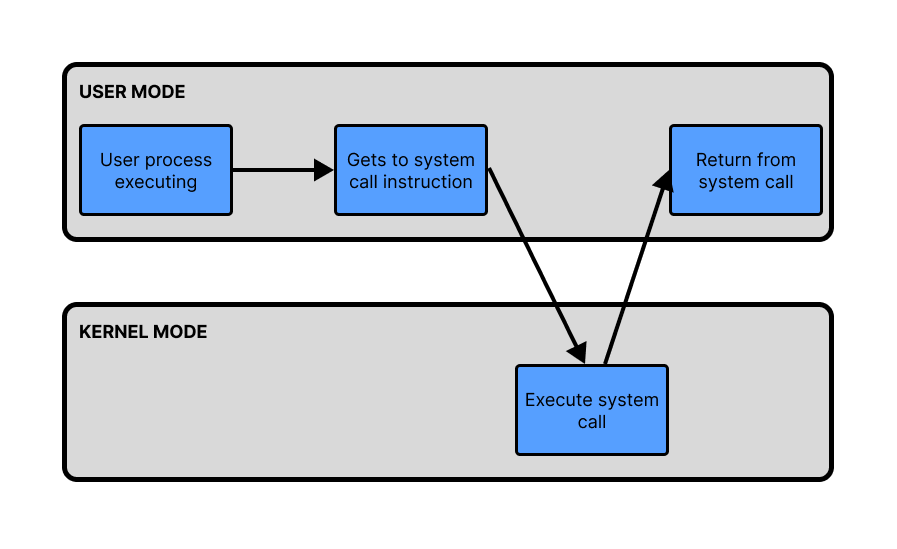
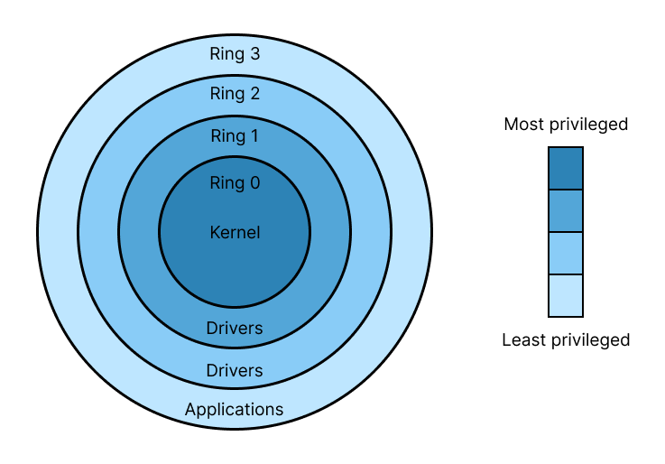

import Callout from '../../../../components/Callout.astro';

Yapa yapa yapa 

## What Is a System Call?

Every program you run relies on the operating system to interact with the real world. The OS manages things like reading files, allocating memory and networking. User space programs can’t just access the hardware or the kernel memory directly, as this would compromise security and make debugging hard.

A system call (syscall) is a mechanism for user-space programs to request services from the kernel. It crosses the boundary between user space and kernel space. Most common tasks, like reading/writing files, spawning processes, allocating memory, all rely on system calls.

### Overview of How They Work

At a high level:

1. The user program calls a library function (e.g., `write()`)
2. The library sets up registers and uses a special CPU instruction (`syscall`) to switch into kernel mode
3. The CPU jumps to the kernel’s syscall handler
4. The kernel looks up the requested syscall and runs the corresponding function
5. The kernel performs the requested operation and returns a result
6. Control returns back to the program with the result

On modern x86-64 systems, the syscall is performed using the efficient syscall instruction (not a traditional interrupt), which transitions the CPU into kernel mode.




## System Call Process In More Detail

### 1. User Program Calls a glibc Function

Glibc is the C standard library. Many of these functions are wrappers for system calls, so we can use them in our C code.

```c
write(1, "hi\n", 3);
```

This snippet calls a wrapper, defined in `/usr/include/unistd.h`, which prepares arguments and invokes the syscall via a special CPU instruction.

### 2. Arguments are placed in specific registers

The syscall ABI (Application Binary Interface) defines exactly which registers to use for system calls. For x86-64 linux, the calling convention is shown below:

| Register | Purpose |
| --- | --- |
| `rax` | System call number |
| `rdi` | 1st argument |
| `rsi` | 2nd argument |
| `rdx` | 3rd argument |
| `r10` | 4th argument |
| `r8` | 5th argument |
| `r9` | 6th argument |

So for our `write` function:
- `rax = 1` (as the system call number for `write` is 1)
- `rdi = fd`
- `rsi = buf`
- `rdx = count`

Then glibc executes the syscall instruction.

### 3. The syscall instruction is executed

At this point, the CPU performs a **privilege level switch**:
- It changes from **ring 3 (user mode)** to **ring 0 (kernel mode)**



<Callout type="info" title="Privilege Rings">
    Linux privilege levels are split into rings.
    - Ring 0 is for **kernel code**
    - Rings 1 and 2 are for **device drviers**
    - Ring 3 is for **user programs**
</Callout>


- It saves the current user-space context and jumps to a predefined kernel entry point

This instruction doesn’t use an interrupt vector - it uses MSRs (Model-Specific Registers) to know where to jump in kernel space.

<Callout type="definition" title="Model Specific Registers (MSRs)">
    Model Specific Registers are control registers that have a specific purpose to control certain features of the CPU. The CPU documentation lists the addresses of each of the MSRs.
</Callout>

In Linux, the syscall entry point is typically set up during boot, pointing to the function:
```c
entry_SYSCALL_64()
```
which lives in `arch/x86/entry/entry_64.S`.

### 4. Kernel handles the system call

The kernel uses the value in `rax` (e.g., `1` for `write`) to look up the **syscall handler** in the syscall table:

```c
sys_call_table[rax]
```

This table is defined in `arch/x86/entry/syscalls/syscall_64.tbl` and compiled into an array of function pointers.

So for `write()`, it dispatches to:

```c
SYSCALL_DEFINE3(write, unsigned int, fd, const char __user *, buf, size_t, count)
```

### 5. Arguments are checked and processed

The kernel now has access to the file descriptor, buffer, and count - but it must:

- Validate that the pointer `buf` points to user-space memory
- Ensure the file descriptor is valid and writable
- Perform the actual write

### 6. Return Value Is Placed in `rax`

When the syscall is done (successfully or with an error), the kernel:

- Places the return value (e.g., number of bytes written or `EFAULT`) into `rax`
- Executes a special return sequence (`sysret`) to return to user space

### 7. Back to User Space

The CPU restores the original user-mode context (registers, flags, stack pointer) and resumes execution just after the `syscall` instruction. The process continues as if nothing special happened - except now `write()` has returned a value.

In other architectures (like ARM64), the syscall mechanism differs but the core idea - trap into the kernel and dispatch via a syscall table - remains the same.


## Directly Invoking a System Call 
We can write a small C program with some inline assembly to see how the write system call gets executed.

- Write the source code into `syscall.c`
```c
// syscall.c
#include <unistd.h>
#include <sys/syscall.h>

int main() {
    const char msg[] = "Hi\n";
    long ret;
    asm volatile (
        "mov $1, %%rax\n"       // syscall number (sys_write)
        "mov $1, %%rdi\n"       // fd = stdout
        "lea %1, %%rsi\n"       // buffer address
        "mov $3, %%rdx\n"       // length
        "syscall\n"
        "mov %%rax, %0\n"
        : "=r" (ret)
        : "m"(msg)
        : "rax", "rdi", "rsi", "rdx"
    );
    return 0;
}
```

- Compile the code

```c
gcc -o syscall syscall.c
```

- Disassemble the code

```c
objdump -d syscall | grep -A20 '<main>:'
```

- This gives the following (annotated) assembly snippet:

```cpp
0000000000401865 <main>:
  401865:    f3 0f 1e fa            endbr64                   # CPU indirect branch tracking (not important here)
  401869:    55                     push   %rbp                 # Set up stack frame
  40186a:    48 89 e5               mov    %rsp,%rbp

  40186d:    48 83 ec 20            sub    $0x20,%rsp           # Allocate stack space

  40187e:    31 c0                  xor    %eax,%eax            # Clear %eax (common initialization)
  401880:    c7 45 f4 48 69 0a 00   movl   $0xa6948,-0xc(%rbp)  # Store bytes of the string to print on stack

  401887:    48 c7 c0 01 00 00 00   mov    $0x1,%rax            # Syscall number 1 (write)
  40188e:    48 c7 c7 01 00 00 00   mov    $0x1,%rdi            # Arg1: file descriptor (stdout)
  401895:    48 8d 75 f4            lea    -0xc(%rbp),%rsi      # Arg2: pointer to string buffer
  401899:    48 c7 c2 03 00 00 00   mov    $0x3,%rdx            # Arg3: length of string (3 bytes)

  ////////////////////////////// THE HOLY SYS CALL /////////////////////////////////
  4018a0:    0f 05                  syscall                     # Invoke kernel, perform the system call
  /////////////////////////////////////////////////////////////////////////////////
  4018a2:    48 89 c1               mov    %rax,%rcx            # Save syscall return value (bytes written)
  4018a5:    48 89 4d e8            mov    %rcx,-0x18(%rbp)     # Store return value

  4018a9:    b8 00 00 00 00         mov    $0x0,%eax            # Prepare return value for main (success)

```

<Callout type="info" title="Note on Disassembly">
    Invoking the write function itself in C is harder to disassemble - compiler optimisations, inlining, dynamic linking and the PLT (Procedure Linkage Table) can obscure the direct syscall instruction. The syscall might be hidden behind several layers of library calls and PLT trampolines, making it difficult to isolate and analyse.
</Callout>

## A Note on Trap Tables

A common misconception is that Linux system calls rely on trap tables (like the Interrupt Descriptor Table, or IDT) to function. 

This was true for older x86 implementations that used `int 0x80` (a software interrupt), but the syscall instruction on modern x86-64 Linux systems bypasses the traditional trap table mechanism entirely using the process explained in this post. 

However, trap tables are still essential for other kinds of exceptions and interrupts, and they’re still used for system calls on some architectures like ARM.  