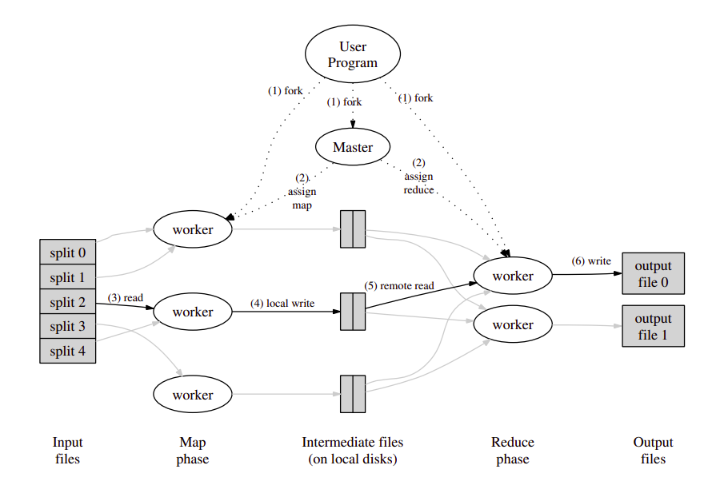

import Callout from '../../../../components/Callout.astro';

MapReduce is programming model and execution framework for processing large data sets distributed across a cluster. It was developed by Google in 2004, and has shaped the architecture of modern large scale data systems, like Hadoop and Apache Spark.

It provides an abstraction layer, so the user can define the simple operation they want to perform without dealing with the details of parallelisation themselves.

The creators realised that a lot of the computations they do can be broken into two main tasks, applying a map operation to each logical record in the input to compute a set of intermediate **key/value pairs**, then applying a reduce operation to all the values that share the same key, in order to combine the data appropriately. 

<Callout type="info" title="Functional Programming Roots">
    The $\text{map}$ and $\text{reduce}$ operations originate from **functional programming** languages like Lisp and Haskell. These paradigms emphasize **immutability** and **pure functions**, which are ideal for parallelism and distributed computation.

    In functional terms:

    ```haskell
    -- Map applies a function to each item in a list
    map f [x1, x2, ..., xn] = [f(x1), f(x2), ..., f(xn)]

    -- Reduce (also called fold) recursively combines elements
    reduce op [x1, x2, ..., xn] = x1 `op` x2 `op` ... `op` xn
    ```
</Callout>

There are two main functions:

- `map` - Apply a function to every input, producing an intermediate key value pair
- `reduce` - Group all values by key and combine them

Both the map and reduce functions are specified by the user for their specific task.

## The Map Function


$$
\begin{align*}\text{map} : (k_1, v_1) &\rightarrow \{(k_2, v_2)_i\}_{i=1}^n\end{align*}
$$

Where:

- $k_1$ and $v_1$ are the input key and value,
- The output is a **multiset** (or list) of zero or more $(k_2,v_2)$ pairs.

This is a homomorphic transformation over an input set.

<Callout type="definition" title="Homomorphic Transformations">
Homomorphism is a structure preserving map between two algebraic structures. 

A **homomorphic transformation** maintains the structure of operations - it ensures that **performing operations after the transformation is equivalent to transforming the result of operations**.

Mathematically:

Let $f$ be a homomorphic transformation from one algebraic structure $(A, \cdot)$ to another $(B, *)$, i.e: 

$$
f: A \to B
$$

Then, for all $a_1, a_2 \in A$:

$$
f(a_1 \cdot a_2) = f(a_1) * f(a_2)
$$

This means: applying the operation $\cdot$ in $A$, then transforming with $f$ yields the same result as first transforming each element and then applying the operation $*$ in $B$.
</Callout>


### Map Function as a Homomorphic Transformation

Let $f: A \to K \times V$ be a transformation function applied to elements of a set $A$, producing key-value pairs in the set $K \times V$, where $K$ is the set of keys and $V$ is the set of values.

The **Map function** in MapReduce can be expressed as:

$$
\text{map}(f): A \to (K \times V)
$$

The Map function satisfies the following **homomorphic property**:

$$
\text{map}(f)(x_1 \cup x_2) = \text{map}(f)(x_1) \cup \text{map}(f)(x_2)
$$

Where $\cup$ denotes the concatenation (or combination) operation of key-value pairs. This means that applying the Map function **after** combining elements is equivalent to applying it **individually** to each element and then combining the results.

In other words, the Map function preserves the structure of the input data by respecting the combination operation. It can be described as:

$
f(a_1 \cup a_2) = f(a_1) \cup f(a_2)
$

Thus, the Map function is **homomorphic** as it maintains the algebraic structure of the input data, ensuring that the transformation is compatible with the combination of elements.

## The Reduce Function

Given that the Map function outputs a set of key-value pairs, the **Reduce function** operates on the grouped key-value pairs.

- Let $K$ be the set of keys produced by the Map function.
- Let $V$ be the set of values associated with each key $k \in K$.

The Reduce function then aggregates or combines the values associated with each key. For each key $k$, the Reduce function $\text{reduce}$ produces a new value $v_{\text{final}}$, typically by applying an associative and commutative operation $\oplus$ (such as sum, average, or max):

$
\text{reduce}(k, \{v_1, v_2, \ldots, v_n\}) = v_{\text{final}}
$

Here, $\{v_1, v_2, \ldots, v_n\}$ are the values associated with key $k$.

### **Mathematical Properties of the Reduce Function:**

The Reduce function is typically defined in terms of an **associative** and **commutative** operation. This means that the operation can be applied in any order or grouping without changing the result.

For a given key $k$, the Reduce function satisfies:

1. **Commutativity**: $v_1 \oplus v_2 = v_2 \oplus v_1$
    - The order of combining values doesn’t affect the result.

2. **Associativity**: $(v_1 \oplus v_2) \oplus v_3 = v_1 \oplus (v_2 \oplus v_3)$
    - The grouping of the values doesn’t change the result.

Thus, the Reduce function preserves the properties of the operation $\oplus$ when aggregating the values for each key.

## Overall MapReduce Function

Let:

- $ D = \{d_1, d_2, \dots, d_n\} $: the input dataset  
- $ \text{map}: D \to \bigcup_{k \in K} \{(k, v)\} $: transforms each data item into key-value pairs  
- $ \text{group}: \{(k, v)\} \to \{(k, [v_1, v_2, \dots])\} $: groups values by key
- $ \text{reduce}: (k, [v_1, \dots, v_m]) \to (k, v') $: reduces a list of values per key to a single output  

Then the entire **MapReduce** process can be written as:

$$
\text{MapReduce}(D) = \left\{ \text{reduce}(k, [v_1, \dots, v_m]) \,\middle|\, (k, [v_1, \dots, v_m]) \in \text{group} \left( \bigcup_{d \in D} \text{map}(d) \right) \right\}
$$


### Intuition
1. Apply `map` to every element in $ D $, producing key-value pairs  
2. Group the values by key  
3. Apply `reduce` to each grouped set

This abstraction allows the workload to be **distributed and parallelized** across machines efficiently.


## Example Function

Consider the problem of counting the number of occurrences of each word in a large collection of documents. Our map and reduce functions could look like this:
```c++
map(String key, String value):
    // key: document name
    // value: document contents
    for each word w in value:
        EmitIntermediate(w, "1");

reduce(String key, Iterator values):
    // key: a word
    // values: a list of counts
    int result = 0;
    for each v in values:
        result += ParseInt(v);
        Emit(AsString(result));
```
The map function returns each word plus its associated count, this would be just one in this case. The reduce function sums together all the counts returned for a particular word (key).

## Execution Model

As this was designed by Google, the execution model followed good practices to ensure fault-tolerance on their large infrastructure.



1. The MapReduce library in the user program splits the input files into $M$ pieces. Then it starts up many copies of the program on a cluster of machines.
2. One of the copies of the program is special - the master. The rest are workers that are assigned work by the master. There are $M$ map tasks and $R$ reduce tasks to assign. The master picks idle workers and assigns each one a map or a reduce task.
3. A worker who is assigned a map task reads the contents of the corresponding input split. It parses the key value pairs out of the input data and to the user-defined Map function. The results are buffered in memory.
4. Periodically, the buffered pairs are written to local disk, partitioned into $R$ regions by a partitioning function. The locations of the buffered pairs are passed back to the master, who forwards these locations to the reduce workers.
5. When a reduce worker is notified about these locations, it uses remote procedure calls to read the buffered data from the local disks of the map workers. When it has read all the intermediate data, it sorts it by the keys so that all occurances of the same key are grouped together. Sorting is needed because typically many different keys map to the same reduce task. If the amount of intermediate data is too large to fit in memory and external sort is used.
6. The reduce worker iterates over the sorted data and for each unique key, it passes the key and the corresponding set of intermediate values to the user’s reduce function. The output is appended to a final output file for this reduce partition.
7. When all map and reduce tasks are complete, the master wakes up the user program. At this point the `MapReduce` function call returns back to the user code. The output is then available in $R$ output files.

## Master Data Structures

The master stores several data structures. For each map and reduce task, it stores the state (idle, in progress, completed) and the identity of the worker machine (for any tasks that have been assigned to a worker).

For each completed map task, it stores the location and sizes of the $R$ intermediate file regions produced. Updates to this location and size information are received as map tasks are completed. The information is then pushed incrementally to workers that have in-progress reduce tasks.

## Fault Tolerance

### Worker Failure

The master pings every worker periodically. If there is no response within a given timeout window, it assumes the worker has failed.

Any completed map tasks return to idle and can then be scheduled on a different worker. These need to be re-executed on failure because the output is stored on the local disk of the failed machine, and is now inaccessible.

Any tasks the worker was doing (map or reduce) also return to idle and get rescheduled. Completed reduce tasks do not need to be re-executed as their output is stored in a global file system.

### Master Failure

The master will write periodic checkpoints of the data structures it contains. This is so if the master task dies, a new copy can be started from the last checkpointed state.

